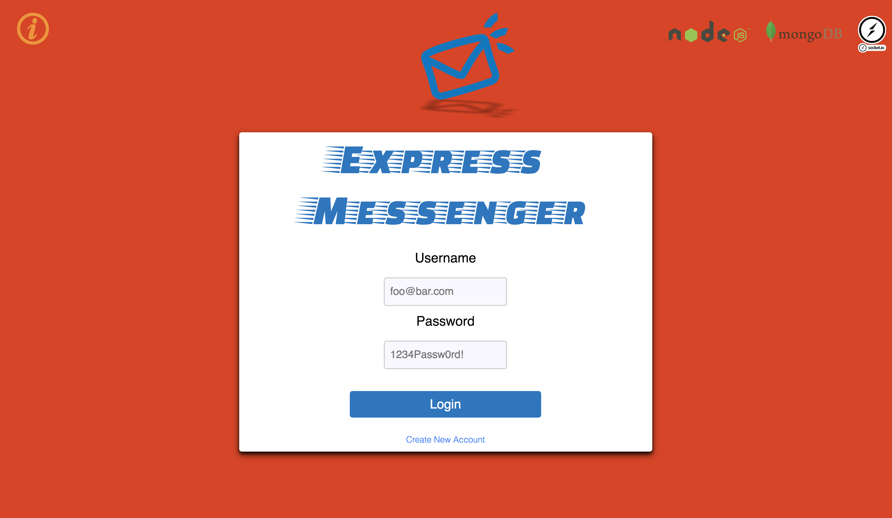
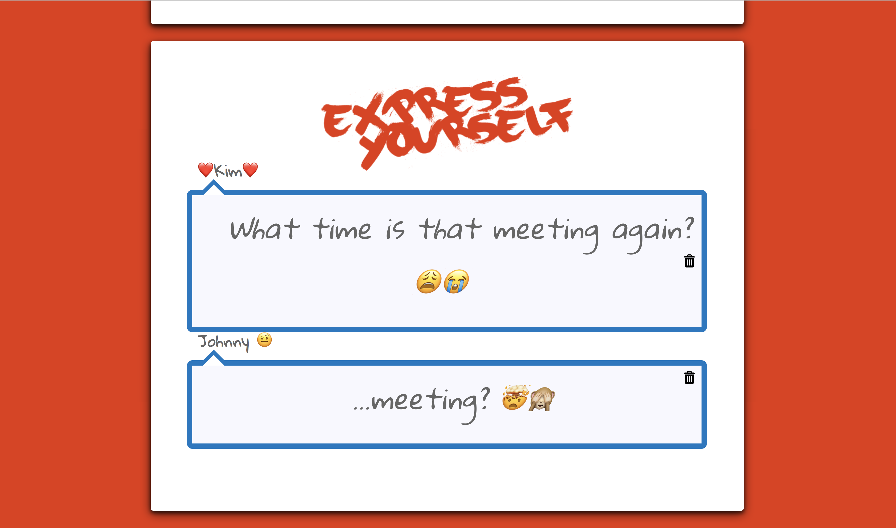

# Express Messenger

A simple web chat using Node, Express, Socket.io, MongoDB and Mongoose

## Inspiration

I was super interested in socket.io and wanted to gain more familiarity around its use, why not create a messenger?!

## Screenshots
Landing Page:

Messages post:

## Summary & Technology Used

Express Messenger is a web chat application that was built using Node, Express, Socket.io, MongoDB and Mongoose.

### Live Link:
https://rocky-refuge-49694.herokuapp.com/?
